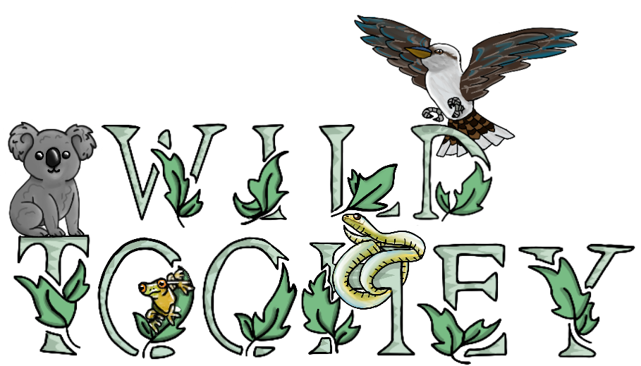

# Wild Toohey: A shiny app for wildlife spotting in Toohey Forest

## Why Wild Toohey?

Wild Toohey was inspired by a desire to make wildlife spotting in Toohey Forest easier and more rewarding.

Wild Toohey harnesses publicly available species occurrence data to help animal lovers, birdwatchers, nature enthusiasts, and bushwalkers get up close and personal to Toohey Forest's diverse wildlife inhabitants.

## What Can You Do With It?

- 🔍 **Find Wildlife**: Use public sightings data to guide you to your own special wildlife encounters
- 🗺️ **Explore Interactive Maps**: View recent wildlife sightings on an interactive map
- 📊 **Discover Trends**: See patterns of annual, monthly, and daily sightings for your selected species
- 🌡️ **Identify Hotspots**: View seasonal heatmaps showing where selected species are most frequently observed
- 📚 **Browse the Species List**: Browse the images and information for all Toohey Forest species.

## How to Use Wild Toohey

1. **Select a species**: In the Explorer tab by common name or taxonomy
2. **View sightings**: In the Finder interactive map
3. **Discover patterns**: Explore past Trends and seasonal spatial Hotspots
4. **View the Species List**: For species images, sightings counts, taxonomic information, and wikipedia links.

### Species Selection Features

Wild Toohey offers two flexible ways to select species:

1. 🔍 **By Common Name**: Simply select or search for a species by its common name (e.g., "Laughing Kookaburra")
2. 🧬 **By Taxonomy**: Navigate the taxonomic hierarchy to view results by taxonomic group:
   - Class (Birds, Mammals, Reptiles, Amphibians)
   - Order (e.g., Passeriformes, Diprotodontia)
   - Family (e.g., Acanthizidae, Phascolarctidae)
   - Species (e.g., Malurus cyaneus, Phascolarctos cinereus)

You can view data for individual species or explore entire taxonomic groups at any level (e.g., all birds, all reptiles within a specific order, or all species within a family). This hierarchical approach allows for both precise species selection and broader ecological patterns to emerge.

## Notes About the Data Behind Wild Toohey

The data behind Wild Toohey comes from the [Atlas of Living Australia (ALA)](https://www.ala.org.au/about-ala/), a collaborative, digital, open infrastructure that pulls together Australian biodiversity data from multiple sources including scientific surveys, citizen science contributions, and historical sources, making it accessible and reusable.

The ALA aggregates data from multiple databases, including:

- [iNaturalist](https://www.inaturalist.org/)
- [eBird](https://ebird.org/)
- [BirdLife Australia](https://birdlife.org.au/)
- [FrogID](https://www.frogid.net.au/)
- [Koala Count](https://biocollect.ala.org.au/acsa/project/index/77285a13-e231-49e8-b1b4-88cd25c8a4fe)
- [WildNet](https://www.qld.gov.au/environment/plants-animals/species-information/wildnet)
- And many others

## Wild Toohey was built using

- **shiny**: Core web application framework
- **bslib**: Modern Bootstrap components for Shiny
- **leaflet & leaflet.extras**: Interactive mapping tools
- **plotly**: Interactive charts and visualizations
- **DT**: Interactive data tables
- **dplyr**: Data manipulation and transformation
- **sf**: Spatial data processing
- **lubridate**: Date and time handling
- **readr**: Data import
- **fontawesome & bsicons**: Icons and visual elements
- **Custom CSS**: For the design throughout
- and with the help of [Claude](https://claude.ai/) and [Shiny Assistant](https://gallery.shinyapps.io/assistant/).

Project Structure:

- **app.R**: Main application file
- **modules/**: Modular components (species selection, maps, stats, etc.)
- **www/**: Static resources (CSS, images)
- **data/**: Spatial data files (Toohey Forest boundary shapefile)

## Try it now!

You can find the app here: [Wild Toohey](https://wildspire.shinyapps.io/Wild-Toohey/)

Happy wildlife watching and forest exploring!
